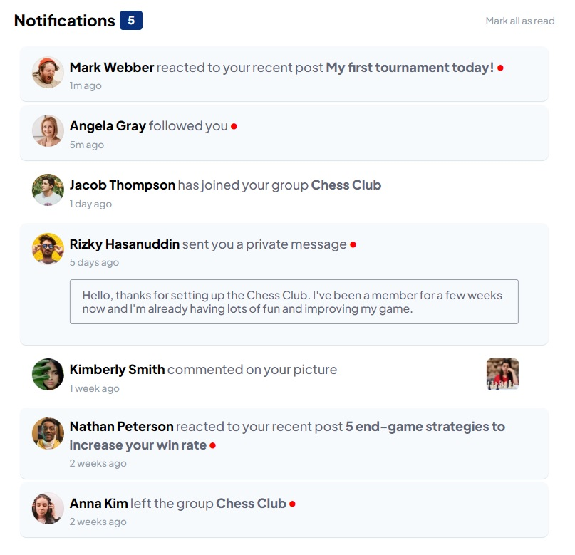

# Frontend Mentor - Notifications page solution

This is a solution to the [Notifications page challenge on Frontend Mentor](https://www.frontendmentor.io/challenges/notifications-page-DqK5QAmKbC).
## Table of contents

- [The challenge](#the-challenge)
- [Screenshot](#screenshot)
- [Links](#links)
- [Built with](#built-with)
- [Author](#author)

### The challenge

Users should be able to:

- Distinguish between "unread" and "read" notifications
- Select "Mark all as read" to toggle the visual state of the unread notifications and set the number of unread messages to zero
- View the optimal layout for the interface depending on their device's screen size
- See hover and focus states for all interactive elements on the page

### Screenshot

### Links

- Solution URL: [https://github.com/DaveJanata/FrontendPractice_NotificationBoard](https://github.com/DaveJanata/FrontendPractice_NotificationBoard)
- Live Site URL: [https://davejanata.github.io/FrontendPractice_NotificationBoard/](https://davejanata.github.io/FrontendPractice_NotificationBoard/)

### Built with

- Semantic HTML5 markup
- CSS custom properties
- Flexbox
- JavaScript

## Author

- LinkedIn - [David Janata](https://www.linkedin.com/in/david-janata-926a88249/)
- Frontend Mentor - [@DadaMlatic](https://www.frontendmentor.io/profile/DadaMlatic)

